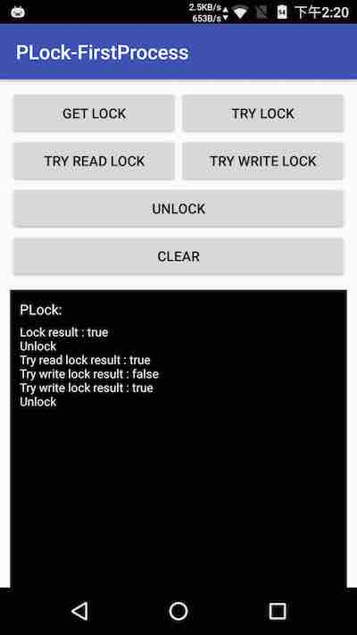
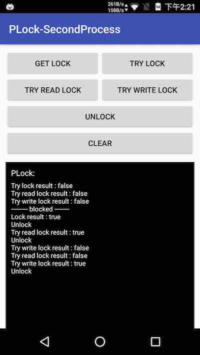

# PLock
PLock is a simple and efficient cross-process lock, also supports read-write lock.

[](./LICENSE)
[](https://jitpack.io/#pqpo/PLock)

PLock is an Android library, it makes Android to support cross-process lock, not only that, it can also be transfer to support Java project.   
It is easy to use and runs efficiently.   
PLock can acquire locks in either blocking（lock） or non-blocking（tryLock） mode. In blocking mode, 
it will block the current thread in the process if the lock you acquire is already hold by another process, 
that only returns false in non-blocking mode.    
PLock also supports read-write lock cross process，If one process holds a read lock, 
the other process can also acquire a read lock successfully，and cannot acquire a write lock. 
If one process holds a write lock, the other process cannot acquire any read or write lock.     
You can also use PLock as a file lock, In fact, it is based on file locks that using 
***[fcntl](http://pubs.opengroup.org/onlinepubs/009604599/functions/fcntl.html)***

||acquire read lock|acquire write lock|
|:---:|:---:|:---:|
|no lock|allow|allow|
|one or more read locks|allow|disallow|
|one write lock|disallow|disallow|

## Getting started

In your `build.gradle`:

```groovy
allprojects {
	repositories {
		maven { url 'https://jitpack.io' }
	}
}

dependencies {
    implementation 'com.github.pqpo:PLock:{last-version}'
}

```

## Usage

- Step 1. get a default PLock object, and you can also create one by yourself.
- Step 2. acquire locks.
- Step 3. unlock.
- Step 4. release if necessary.

For example:

```java
PLock pLock = PLock.getDefault();
// OR you can also use it as a file lock:
// PLock pLock = new PLock(file);

pLock.lock(); 
try {
    // to do something...
} catch (Exception e) {
    // errors
} final {
    pLock.unlock(); 
}

// in non-blocking mode
if(pLock.tryLock()) {
   try {
       // to do something...
   } catch (Exception e) {
       // errors
   } final {
       pLock.unlock(); 
   }
} 

// non-block read lock
if(pLock.tryReadLock()) {
    // to do something...
} 
// non-block write lock
if(pLock.tryWriteLock()) {
    // to do something...
} 

// etc.


// pLock.release(); 

```

## Play with samples, have fun!

You can clone this repository, then run 'debug' build variant and 'second' build variant, 
after that you can see two applications running on your phone which named PLock-FirstProcess and PLock-SecondProcess. 
 
Or download [PLock-FirstProcess](art/PLock-FirstProcess.apk) and [PLock-SecondProcess](art/PLock-SecondProcess.apk).


|PLock-first-process|PLock-second-process|
|:---:|:---:|
|||

## About Me：

- Email：    pqponet@gmail.com
- GitHub：  [pqpo](https://github.com/pqpo)
- Blog：    [pqpo's notes](https://pqpo.me)
- Twitter: [Pqponet](https://twitter.com/Pqponet)
- WeChat: pqpo_me


## License

    Copyright 2018 pqpo
    
    Licensed under the Apache License, Version 2.0 (the "License");
    you may not use this file except in compliance with the License.
    You may obtain a copy of the License at
    
       http://www.apache.org/licenses/LICENSE-2.0
    
    Unless required by applicable law or agreed to in writing, software
    distributed under the License is distributed on an "AS IS" BASIS,
    WITHOUT WARRANTIES OR CONDITIONS OF ANY KIND, either express or implied.
    See the License for the specific language governing permissions and
    limitations under the License.


